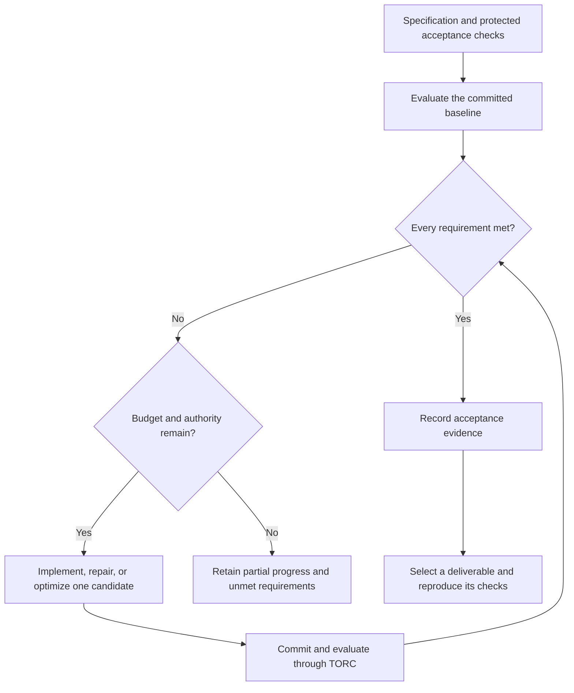

# Engineering: build, repair, and optimize

Use an engineering workflow when success means meeting a specification. Required
behavior, regression tests, numerical limits, and performance targets define the
work. A scientific question or literature review is not a prerequisite.

Waterology provides an `engineering` CLI entry, an `engineering-workflow` skill,
and an `engineer` candidate role. They use the same durable study records, TORC
execution, and run archives as research studies. Existing `mode: engineering`
contracts and `study` commands remain supported.



_Figure 1. Engineering acceptance requires every declared check to pass.
Partial progress remains available when the study stops. Unknown execution
outcomes must be reconciled before another submission._

## Build or repair to a specification

Prepare an initialized project with a named workflow such as `qualify`. The
workflow should run protected acceptance checks and write declared metrics. See
[workflow registration](workflow-execution.md#register-and-run-an-evaluation).
A useful starting contract measures `failed_checks`, a finite numeric count that
must equal zero for a correctly implemented evaluator. Missing, Boolean, string,
or nonfinite values do not pass numeric acceptance.

For example, a parser specification might require accepting valid records,
rejecting malformed records, and preserving existing round-trip behavior. Keep
those checks outside the candidate's allowed source paths. Emit `failed_checks`
only after all checks run. The metric is an interface to your test harness;
Waterology does not infer coverage or correctness from a test suite's name.

Draft the contract without starting execution:

```console
waterology engineering init engineering.nt \
  --objective "Implement the parser specification" \
  --workflow qualify --allow-path src/parser \
  --max-iterations 8 --max-seconds 1800
```

Inspect the generated `.nt` file. Replace its evaluation notes with the actual
specification, test suite identity, and uncertainty treatment. Add separate
acceptance rules where an aggregate count would hide a required distinction.
Commit the workflow, environment locks, specification, and protected checks.
Do not include those files in `allowed_paths`. The example budget is illustrative;
choose bounds appropriate to the authorized task.

The build draft uses `candidate_strategy: latest_completed`. Each driver proposal
starts from the most recent completed and assessed candidate, including a candidate
with unmet requirements. This supports cumulative implementation. A running,
unknown, failed, or unassessed attempt cannot become that parent. Parent selection
does not count as acceptance or permit changing protected evaluation files.

## Optimize under fixed constraints

Add a performance target when drafting the contract:

```console
waterology engineering init optimization.nt \
  --objective "Reduce runtime while preserving parser behavior" \
  --workflow benchmark --allow-path src/parser \
  --target-seconds 2.5 --max-iterations 10 --max-seconds 3600
```

This creates two requirements: `failed_checks <= 0` and `elapsed <= 2.5` seconds.
The target is an example, not a measured result or recommended default. Replace
these metrics with those emitted by the actual evaluator. Add memory, numerical
error, or workload-specific regression limits as needed. Every rule must pass;
improved aggregate runtime cannot cancel a failed correctness check.

The optimization draft uses `candidate_strategy: best`, which starts from the
controller's selected feasible run or from the baseline when none exists.
`promotion_metric: elapsed` ranks feasible candidates. Engineering stops once a
candidate meets all thresholds, including the baseline if it already qualifies.
This is target attainment within a budget, not an open-ended search for a global
optimum. To accumulate changes before reaching a target, explicitly select
`latest_completed` before authorizing the study.

Fix the benchmark inputs, environment, timing protocol, repetitions, and allowed
variation before execution. The study records the declared uncertainty treatment;
it does not manufacture timing confidence intervals.

## Create, run, and inspect

Configure a TORC profile, including for local evaluation. Record the user's actual
authorization when creating the study:

```console
waterology engineering create engineering.nt --profile local \
  --authorized-by "Reference to the user's bounded authorization"
waterology engineering show STUDY_ID
```

Replace the authorization text and ID with actual values. Creating the study
queues its baseline. For manually authored candidates, use the shared experiment
worktrees and engineering controls:

```console
waterology experiment create "Implement parser validation" --workflow qualify
waterology worktree open EXPERIMENT_ID
```

Make the allowed change and commit it in the returned worktree, then:

```console
waterology engineering enqueue STUDY_ID EXPERIMENT_ID
waterology engineering watch STUDY_ID
```

For authorized bounded candidate generation:

```console
waterology engineering driver STUDY_ID --runtime codex --max-proposals 5
waterology engineering run STUDY_ID
```

Configure the driver once. Resume with `engineering run`; do not create another
study or driver after an interruption. Candidate sessions use the `engineer` role.
The controller owns evaluation, while the candidate agent runs only the declared
lightweight checks. Runtime permissions remain authoritative.

`engineering show` displays requirements, observed values, thresholds, attempt
states, and accepted run IDs. It verifies archived evidence and compares current
metrics with the saved assessment. Missing, tampered, or changed evidence is
unverified rather than accepted. The dashboard's Studies view also lists the
engineering requirements; the CLI provides the fresh acceptance check.

MCP exposes `engineering_create` with a project contract path and
`engineering_status`. Shared `study_enqueue`, `study_advance`, and `study_stop`
tools operate on the same IDs. There is no parallel engineering database.

## Stop and hand off

```console
waterology engineering stop STUDY_ID
waterology engineering show STUDY_ID
```

The saved drain or cancel policy governs active work. Stop at acceptance, the
budget boundary, an explicit request, or an unresolved blocker. Attempt budgets
and the wall-clock deadline are enforced; CPU-hours and model token costs are
not metered. A stopped study may preserve useful partial implementation without
meeting the specification.

Sealed runs receive [RO-Crate provenance exports](ro-crate.md). Select a passing
reference run explicitly before [registering and reproducing a deliverable](workflow-execution.md#select-and-reproduce-the-final-result).
Engineering acceptance, crate validation, and fresh reproduction answer separate
questions. None automatically merges, deploys, or publishes the result.

The [validation record](validation/2026-09-24-engineering-ro-crate.md) separates
controller and local TORC checks from untested remote and unattended sessions.
