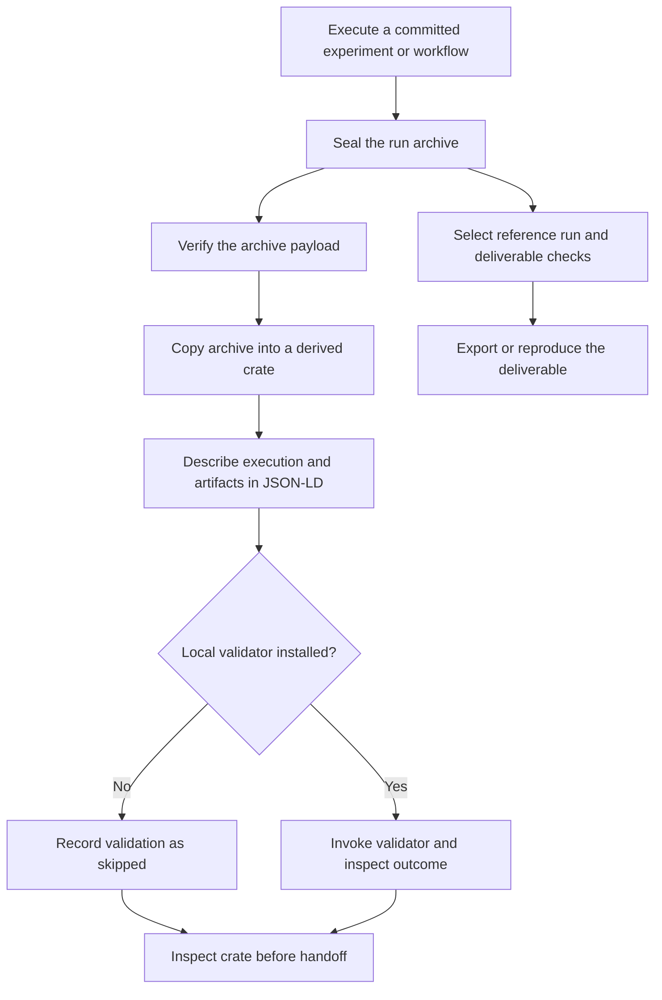

# Export run provenance with RO-Crate

Waterology creates a derived RO-Crate when it seals a run. The crate places a
copy of the run archive beside JSON-LD metadata describing the execution, source,
inputs, metrics, and outputs. Use it to inspect or exchange a run's provenance.
Use a [deliverable export](workflow-execution.md#select-and-reproduce-the-final-result)
when the handoff needs Waterology's declared reproduction checks.

The integration is tested with the pinned `roc-validator==0.11.4` release at its
REQUIRED level for Process Run and Workflow Run fixtures, including invalid
metadata rejection. A particular export still needs its own validation result.
Acceptance by a repository service is a separate check. This guide describes
the current [exporter](../src/waterology/core/rocrate.py). The separate
[RO-Crate evaluation](workflow-run-ro-crate.md) records the design recommendation
and external ecosystem research.

## Where it fits



_Figure 1. RO-Crate export describes an existing execution. Deliverable
reproduction executes again and checks fresh outputs. Neither metadata generation
nor metadata validation replaces archive integrity verification or scientific
review. A validator rejection is recorded and needs inspection; automatic packaging
failure does not invalidate a sealed computation._

The automatic crate lives at `.waterology/ro-crates/RUN_ID/`. There is no separate
registration step. Failed runs can also have sealed archives and derived crates;
a crate's existence does not mean the calculation succeeded. Inspect the recorded
run status and missing outputs.

## Inspect or export a run

From the initialized project, replace `RUN_ID` with the actual identifier:

```console
waterology run status RUN_ID
waterology archive verify RUN_ID
waterology archive export-crate RUN_ID exports/run-crate
```

The last command creates a separate directory inside the project. The destination
must be a relative path without parent traversal and must not already exist.
Use a new destination for another copy. This command does not create a ZIP,
upload to a repository, or run the model again. Add `--json` for a structured
response containing the destination.

The automatic crate and manual export have the same structure:

```text
exports/run-crate/
  ro-crate-metadata.json       JSON-LD description of the run and its evidence
  ro-crate-validation.json     validation result, including skipped or failed
  run/                        copy of the sealed Waterology archive
    manifest.json             run identity, commit, status, and artifact inventory
    command.json              executed argument list
    execution-config.json     saved execution configuration
    environment.json          recorded environment evidence
    metrics.json              extracted measurements
    stdout.log
    stderr.log
    source.tar.zst            source at the recorded commit
    source-commit.txt         original commit object
    checksums.sha256          payload checksums
    seal.json                 seal record
    artifacts/                collected declared outputs, when present
```

Additional archive members, such as TORC workflow files, are copied when present.
The wrapper metadata sits outside `run/`, so creating it does not alter the
original archive's checksums. The metadata records the seal state and seal hash.
It does not provide a separate checksum seal for the entire wrapper.

## What the metadata describes

| Archived evidence | Metadata representation | How to use it |
| --- | --- | --- |
| Run ID, timestamps, and terminal state | A `CreateAction` named `#run` | Identify the execution and its reported outcome |
| Source commit and source archive | `SoftwareSourceCode` with a version and source file | Trace outputs to the evaluated source |
| Submitted TORC definition | A file typed as `ComputationalWorkflow` and referenced by the action | Identify the executed workflow, including the generated Slurm definition |
| Declared input file hashes | Separate identity values linked by `waterology:inputIdentities` | Identify expected inputs; these are not included input bytes or parameter bindings |
| Collected outputs | File entities linked from the action's results | Locate the archived artifacts |
| Metrics | `PropertyValue` entries on `run/metrics.json` | Inspect values and configured extraction fields |
| Environment and checksums | References to the corresponding archive files | Inspect environment evidence and verify payload integrity |

Metadata uses the sealed manifest and archived execution configuration. It never
falls back to current project settings. Matching the saved command to a unique
registered workflow preserves metric selectors and declared input identities.
Ambiguous or absent matches do not invent those annotations. The command and
source archive remain identified independently.

## Profiles and validation

Waterology emits the compatible profile set implemented by its pinned validator:

| Evidence available | Declared profiles | Validator profile |
| --- | --- | --- |
| A sealed command execution | RO-Crate 1.1 and Process Run 0.5 | `process-run-crate-0.5` |
| An archived submitted TORC definition and executor reference | Also Workflow RO-Crate 1.0 and Workflow Run 0.5 | `workflow-run-crate-0.5` |

A registered command alone does not establish Workflow Run conformance. For Slurm,
the generated submitted definition is the main workflow; the original definition
remains a separate archived file. The exporter does not claim Provenance Run
conformance or reconstruct individual steps from logs.

The [design evaluation](workflow-run-ro-crate.md) discusses the newer RO-Crate 1.3 /
Workflow Run 0.6 specifications. The pinned validator does not implement that set,
so exports deliberately use the supported versions. A future upgrade needs matched
profile support and new positive and negative conformance tests.

Install the optional validator with the package's `rocrate` extra. In a source
checkout, use the dedicated environment:

```console
pixi install -e rocrate --locked
pixi run -e rocrate waterology archive export-crate RUN_ID exports/validated-crate
```

Run project commands in the target project's environment; the source-checkout
example assumes that checkout contains the run being exported. An installed CLI
with the extra can be used directly from another initialized project.

Waterology checks the validator version, selects the profile explicitly, disables
automatic profile selection, and requests REQUIRED checks with inheritance. A
pass requires both a zero exit and a successful structured report for the selected
profile. Validator execution has a timeout, and reports retain command, version,
profile, severity, exit code, stdout, and stderr when available. JSON-LD contexts
may require network access. Network failures do not count as conformance passes.

| Result | Meaning and next action |
| --- | --- |
| `skipped` | Validator unavailable or explicitly disabled through the Python API; conformance was not checked. |
| `passed` | The pinned validator accepted the selected profile at REQUIRED severity. Recommended or optional criteria are outside this gate. |
| `failed` | Validation rejected the export or did not return a successful structured report. Inspect the saved diagnostics. |
| `error` | Unsupported validator version, timeout, or launch failure. Resolve the environment and export to a new destination. |

Manual export writes `ro-crate-validation.json` before returning an error for
failed validation. The copied payload and metadata remain available for inspection.
An export refuses an existing destination, symlinked paths, and repository control
state. Use a new destination after fixing the cause.

Automatic export preserves an existing crate and its diagnostics. On a packaging
failure it records `.waterology/ro-crate-errors/RUN_ID.json`; if diagnostic storage
also fails, it logs a warning. The original sealed run remains available. Inspect
these records and create a fresh manual export rather than repeating the model.

The [conformance tests](../tests/core/test_rocrate.py) exercise real validator
acceptance and invalid metadata rejection. Run them explicitly with:

```console
WATEROLOGY_TEST_ROCRATE=1 pixi run -e rocrate pytest tests/core/test_rocrate.py -k real_validator
```

The default test suite skips these two optional tests and still checks graph
structure, payload integrity, path confinement, timeouts, and failure retention.
WorkflowHub, Zenodo, and Galaxy live import qualification remains untested.

## Choose the right handoff

| Need | Use |
| --- | --- |
| Check whether the original payload changed | `waterology archive verify RUN_ID` |
| Exchange an execution description and its archived evidence | `waterology archive export-crate RUN_ID DEST` |
| Preserve a selected reference result and declared checks | `waterology deliverable export NAME DEST` |
| Run again and compare with the reference | `waterology reproduce NAME DEST --profile PROFILE` |

There is no RO-Crate import or replay command in the current integration.
`waterology reproduce --bundle` consumes a Waterology deliverable export; the
RO-Crate wrapper is not that bundle.

Before sharing a crate, review both metadata and payload. The wrapper omits the local repository URI, but the copied archive includes source,
logs, environment details, and collected artifacts. Export does not redact every
private field or determine redistribution rights. Its rights statement grants no
permission; review the original source and data terms. External input hashes describe
identity without establishing access. Exporting a crate does not publish it or
qualify it for a destination service.

See the [implementation validation record](validation/2026-09-24-engineering-ro-crate.md)
for the tested profile set and local TORC smoke evidence.
