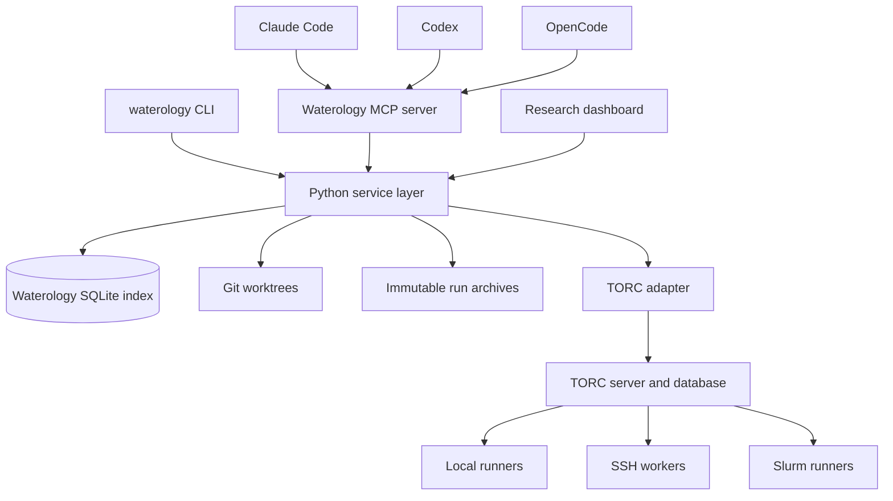

# Waterology Platform Design

Date: 2026-08-24

Status: Approved in conversation, pending written review

## Summary

Waterology will grow from a Claude Code plugin into an open source research
platform for Claude Code, Codex, and OpenCode. One set of skills and agent
definitions will support all three runtimes. A Python package named
`waterology` will provide the stable command line interface, experiment
database, Git worktrees, immutable run archives, agent sessions, MCP server,
and local research dashboard.

Waterology will use [TORC](https://github.com/NatLabRockies/torc) for managed
execution. TORC will schedule local, SSH, and Slurm work. Waterology will add
the scientific layer that TORC does not provide: hypotheses, experiment trees,
evidence, assessments, source snapshots, and agent provenance.

The design adapts portable methods and prompts from
[alphaXiv/openresearch-cli at commit
`13049867497de8fd5e15253cd818462629edd690`](https://github.com/alphaXiv/openresearch-cli/tree/13049867497de8fd5e15253cd818462629edd690).
Waterology will neither require the OpenResearch desktop application nor call
its hosted services.

## Goals

Waterology will:

1. Support Claude Code, Codex, and OpenCode from one repository.
2. Preserve one canonical copy of each skill and agent definition.
3. Manage hypothesis based experiments in isolated Git worktrees.
4. Archive each run with enough source, command, environment, log, metric, and
   artifact information to inspect it without the live database.
5. Use TORC for local, SSH, and Slurm execution.
6. Track parallel agent sessions without replacing runtime native session
   protocols.
7. Provide the same research operations through a CLI, MCP server, and local
   dashboard.
8. Preserve the existing Claude plugin workflows during migration.
9. Credit each adapted source at the file and repository levels.

## Non-goals

The first implementation will not:

- Reimplement TORC scheduling, workers, resource accounting, retries, TUI, or
  job dashboard.
- Depend on the OpenResearch application, hosted API, or `orx` CLI.
- Call model provider APIs directly.
- Normalize the private transcript format of each agent runtime.
- Push Git branches, publish artifacts, or delete remote files automatically.
- Add Kubernetes, Ray, Hugging Face, or Modal execution providers.
- Use OpenCode's beta process plugin API.
- Provide accounts, hosted storage, or a public dashboard service.

## Design principles

### One research core, several adapters

The Python service layer will own research behavior. The CLI, MCP server,
dashboard, and runtime installers will call that service. Runtime adapters will
translate files and process controls, but they will not contain experiment
logic.

### Portable records outrank indexes

Committed project configuration and immutable archive manifests are the source
of truth. SQLite provides fast queries and live coordination. A user can
rebuild the database from durable records.

### Scientific state differs from operational state

TORC can determine whether a job finished. Waterology determines whether the
result answered the hypothesis. A completed job remains scientifically
unassessed until a person or agent records evidence and an assessment.

### Native runtimes remain native

Claude Code, Codex, and OpenCode will retain their own sessions, permissions,
tools, and subagents. Waterology will launch and observe top level processes,
provide shared skills, and record durable metadata.

### Explicit external effects

The CLI may create local files, Git worktrees, processes, and TORC workflows as
part of a requested operation. It will ask before the first launch on a remote
compute profile. It will never infer permission to push, publish, or remove
remote data.

## Architecture



The service layer will expose focused modules for configuration, experiments,
worktrees, archives, execution, sessions, artifacts, and events. Each module
will have a typed interface and no knowledge of presentation details.

### Technology choices

Waterology will require Python 3.11 or later. It will use Typer for commands,
Rich for human output, Pydantic for validated records, and the standard
`sqlite3` and `tomllib` modules for local state and project configuration.
Numbered SQL files will define database migrations. The project will use a
`pyproject.toml` package and a Pixi development environment.

Dashboard and TORC integrations will be optional package extras. The dashboard
extra will install Starlette, Jinja2, and Uvicorn. The TORC extra will install
TORC's generated Python client, but users will install the TORC binaries through
their existing machine or site setup. The MCP extra will install the official
Python MCP SDK. `waterology doctor` will identify missing extras and binaries
without preventing unrelated commands from running.

## Repository and package layout

The repository will keep source assets and generated adapters together:

```text
.claude-plugin/               Claude plugin manifest
.codex-plugin/                Codex plugin manifest
.opencode/                    generated OpenCode agent assets
agent-definitions/            canonical agent definitions
agents/                       generated Claude agents
.codex/agents/                generated Codex agent definitions
commands/                     Claude compatibility commands
skills/                       canonical Agent Skills
src/waterology/               Python package
tests/                        unit and integration tests
docs/                         design, use, and attribution notes
```

Generated runtime files will remain in version control. A renderer will produce
them from canonical definitions. CI will regenerate the files and fail when the
working tree changes.

The product, Python package, executable, and new manifests will use the name
`waterology`. Existing Claude installation paths and commands will remain as
compatibility entry points during the migration. Renaming the remote repository
is a separate external action and is outside this implementation.

## Runtime packaging

### Shared skills

The root `skills/` directory will contain the canonical Agent Skills. Each skill
will keep standard `SKILL.md` frontmatter and avoid runtime specific tool names
where a capability description works. Small runtime notes may explain genuine
differences.

Claude Code and Codex plugin manifests will expose the root skills directly.
The OpenCode installer will place or link the skills in a supported OpenCode or
shared Agent Skills directory. The installer will prefer links in development
checkouts and copies for packaged releases.

The design follows the published skill mechanisms for
[Claude Code](https://code.claude.com/docs/en/skills),
[Codex](https://learn.chatgpt.com/docs/build-skills), and
[OpenCode](https://opencode.ai/docs/skills).

### Agent definitions

`agent-definitions/*.md` will hold canonical role instructions and neutral
metadata. The renderer will create:

- `agents/*.md` for Claude Code.
- `.codex/agents/*.toml` for Codex project installation.
- `.opencode/agents/*.md` for OpenCode.

The first roles remain `researcher`, `reviewer`, `verifier`, and `writer`.
Adapted OpenResearch delegation guidance will improve task briefs, branch
ownership, compute authorization, and return contracts. It will not introduce
an `orx` command requirement.

### Project guidance and commands

`AGENTS.md` will become the canonical repository guidance. `CLAUDE.md` will
point to it and contain only Claude specific notes. OpenCode and Codex adapters
will use the same guidance.

Existing Claude slash commands will remain as generated compatibility shims.
Their durable workflows will live in skills so Codex and OpenCode receive the
same behavior without a command emulation layer.

### Installation

The CLI will provide:

```console
waterology install claude
waterology install codex
waterology install opencode
waterology install all
waterology doctor
```

Installers will report every destination, refuse to overwrite unrelated files,
and support `--dry-run`. Installation will not edit provider credentials.

## Project state

A Waterology research project will use this layout:

```text
waterology.toml               committed project configuration
artifacts/                    durable reports, figures, and exports
.waterology/                  ignored local state
  state.sqlite                rebuildable query and coordination index
  runs/<run-id>/              immutable run archives
  worktrees/<experiment-id>/  isolated experiment worktrees
  sessions/<session-id>/      agent logs and metadata
  staging/                    incomplete archives and generated TORC specs
```

`waterology init` will add `.waterology/` to the project's `.gitignore`. It
will never ignore `waterology.toml` or `artifacts/`.

### Committed configuration

`waterology.toml` will define:

- The project name and artifact roots.
- A fixed run command as an argument array.
- Expected environment files and lockfiles.
- The default compute profile name.
- Declared output paths and metric extractors.
- Concurrency limits and archive rules.

Experiment variants will change committed code or configuration. They will not
encode scientific variants as hidden environment values or one time shell
flags.

### Machine configuration

`~/.config/waterology/config.toml` will map portable compute profile names to
machine settings. A profile can name a TORC API URL, execution mode, TORC site
profile, Slurm account, target shell, SSH alias, and local output root.
Credentials will remain in SSH, TORC, or provider configuration.

An illustrative configuration is:

```toml
[profiles.local]
provider = "torc"
mode = "local"
api_url = "http://localhost:8080/torc-service/v1"

[profiles.cluster]
provider = "torc"
mode = "slurm"
api_url = "http://localhost:8085/torc-service/v1"
torc_profile = "cluster"
slurm_account = "your-project"
target_shell = "posix"
```

Project files will refer to `local` or `cluster`, not to machine paths or
credentials.

## Experiment model

An experiment represents one hypothesis applied to one frozen parent commit.
Each experiment records its identifier, parent, hypothesis, branch, worktree,
creation time, owner, and current status.

An experiment starts as `provisional`. Setup failures, missing dependencies,
and resource failures can be repaired within it. A run that answers the
scientific question freezes the experiment. Later work must branch from the
frozen commit.

Each run has an operational state and a scientific assessment.

Operational states are:

```text
queued -> preparing -> running -> collecting -> completed
                     |          |             -> failed
                     |          -> cancelled
                     -> unknown -> prior known state
                                -> lost
```

`unknown` means Waterology cannot reach the executor. It is reversible.
`lost` means reconciliation confirms that the recorded process or TORC job no
longer exists.

Scientific assessments are:

- `unassessed`: no scientific decision exists.
- `invalid`: setup or execution did not test the hypothesis.
- `no_answer`: the run completed but remained inconclusive.
- `answer`: the evidence supports a positive, negative, or null answer.

An `answer` freezes the experiment. Two consecutive `no_answer` assessments
stop automatic repair and require a decision from the user. Operational
completion alone never freezes an experiment.

## Worktrees and Git rules

`waterology experiment create` will create a branch and isolated worktree from
the chosen parent. One writing agent owns each worktree. Reviewers and
verifiers will inspect a frozen commit through a separate worktree or read only
snapshot.

`waterology run start` will require a clean worktree and a committed variant.
The run record will capture the exact commit before submission. Waterology will
refuse concurrent writers and avoid merge or rebase operations on branches
that contain recorded results.

Waterology will use the Git command line instead of a Git library. Commands
will pass explicit argument arrays and capture stable porcelain output.

## Immutable run archives

Each terminal run will produce this archive:

```text
.waterology/runs/<run-id>/
  manifest.json
  checksums.sha256
  source.tar.zst
  command.json
  environment.json
  stdout.log
  stderr.log
  metrics.json
  assessment.json
  result.md
  artifacts/
```

The manifest will record the project, experiment, commit, command, timestamps,
executor, TORC identifiers, terminal state, declared artifacts, and schema
version. `environment.json` will contain lockfile hashes, tool versions,
operating system, architecture, compute profile, and an allowlisted environment
fingerprint. It will exclude raw secrets and the complete process environment.

Waterology will build an archive in `.waterology/staging/`. After collection,
it will write hashes for every payload, move the directory atomically into
`runs/`, and mark it sealed. `waterology archive verify` will compare the
payload with `checksums.sha256`. Waterology will never edit or remove a sealed
archive automatically.

The SQLite database will index archives but will not replace them.
`waterology repair-index` will recreate database records from manifests and
session metadata.

## Command line interface

The first stable command groups are:

```console
waterology init
waterology status
waterology doctor
waterology install <runtime|all>

waterology experiment create|list|show|note
waterology worktree open|list
waterology run start|list|status|logs|watch|cancel|assess
waterology archive list|show|verify|export
waterology artifacts list|export
waterology repair-index

waterology agent start|list|status|logs|resume|stop
waterology dashboard
```

Read commands and status commands will support `--json`. Errors will use stable
codes and structured details. Long operations will print progress in the human
format and emit discrete events in JSON mode.

## Execution providers

Waterology will retain a small provider protocol:

```text
prepare -> launch -> inspect -> cancel -> collect
```

The first implementation will provide `direct` and `torc`.

### Direct provider

The direct provider is a small local fallback for tests, simple commands, and
users who install only the research skills. It will run one subprocess in the
experiment worktree, capture logs, record its process identifier, and collect
declared outputs. It will not schedule resources, retry failures, use SSH, or
submit to Slurm.

### TORC provider

TORC is the recommended provider for managed runs. It already supplies one
workflow description across local, SSH, and Slurm execution, with dependency
resolution, retries, resource accounting, durable workflow records, a TUI, and
a dashboard. See the [TORC overview](https://github.com/NatLabRockies/torc),
[execution modes](https://natlabrockies.github.io/torc/latest/getting-started/getting-started.html),
and [remote worker guide](https://natlabrockies.github.io/torc/latest/specialized/remote/remote-workers.html).

Waterology will generate a TORC workflow from the fixed project command,
resource request, worktree snapshot, and declared outputs. It will use the
generated Python OpenAPI client for workflow creation and status queries. It
will use TORC commands for runner startup, remote workers, and Slurm submission.
The adapter will record the API URL, workflow ID, job IDs, execution mode, and
TORC version.

Waterology will map TORC states into its smaller operational state model. It
will import logs, resource metrics, results, and declared artifacts when the
workflow reaches a terminal state. Detailed worker and job inspection will
open TORC's TUI or dashboard instead of duplicating those screens.

`waterology doctor` will check the TORC client, required binaries, version
compatibility, API connectivity, and profile configuration. Managed execution
will fail with installation guidance when TORC is absent. The skills, direct
provider, and archive inspection will continue to work.

## Agent sessions

Waterology will launch top level Claude Code, Codex, and OpenCode processes
through runtime adapters. Each adapter will implement:

```text
launch -> inspect -> resume -> interrupt -> collect
```

Each session will receive an experiment worktree, a self contained task brief,
an agent role, shared skills, project guidance, MCP access, artifact paths, and
an explicit compute profile. Waterology will store the runtime's native session
identifier, process metadata, experiment, worktree, role, timestamps, log
paths, and resulting commits.

Session states are `created`, `running`, `waiting`, `completed`, `failed`,
`cancelled`, and `lost`. A runtime crash will preserve the worktree and logs.
Resume will use the native session mechanism when the runtime supports it.

Native subagents remain under runtime control. Hooks or MCP calls may report
their metadata, but Waterology will not require that reporting for correctness.

## MCP server

The local stdio MCP server will call the same service layer as the CLI. It will
offer tools to:

- Create and inspect experiments.
- Start, inspect, cancel, and assess runs.
- Read logs and resource metrics.
- Register evidence and artifacts.
- Inspect experiment trees and archives.
- Record session notes.

The MCP server will not provide unrestricted shell execution. Agent runtimes
already govern shell access, and TORC governs managed compute. Runtime manifests
will register the Waterology MCP server through their supported configuration.

## Research dashboard

`waterology dashboard` will start a local web server and open the browser. The
approved layout puts research state first. Its views are:

- `Overview`: experiment tree, active agents, recent evidence, and TORC state.
- `Experiments`: hypotheses, parents, assessments, commits, and archived runs.
- `Agents`: sessions, worktree ownership, logs, and resume controls.
- `Evidence`: claims, metrics, notes, and supporting artifacts.
- `Archives`: manifests, logs, snapshots, figures, and exports.
- `Compute`: TORC workflow summaries and links to TORC's dashboard or TUI.

The dashboard will use Starlette, Jinja2, Uvicorn, and a small checked in
JavaScript module for live events. It will require no Node build. Server
rendered pages will work without live updates. The interface will provide dark
and light themes, restrained earth tones, accessible contrast, and colorblind
safe status encodings that do not rely on color alone.

The first release will support guarded actions to create an experiment, start
or resume an agent, start or cancel a run, record an assessment, and export an
archive. These actions will call the service layer and use the same validation
as the CLI.

The server will bind to `127.0.0.1` by default. Remote use will rely on SSH port
forwarding. A non-loopback bind will require an explicit flag and an access
token.

## Database and events

Waterology will use SQLite in WAL mode with short transactions and a busy
timeout. The initial schema will index projects, experiments, runs, sessions,
artifacts, evidence, events, and executor references.

Every mutation will first append an intent event, commit its database
transaction, perform the external action, and then record the observed result.
Commands and dashboard refreshes will reconcile incomplete intents against Git,
TORC, local processes, and archive manifests.

Append only text logs will remain readable outside SQLite. Schema migrations
will be forward only. The archive and session formats will carry independent
schema versions so `repair-index` can reject unsupported records without
silently losing data.

## Failure handling and recovery

Waterology will preserve evidence when failures occur:

- If TORC is unreachable, a run becomes `unknown`, not `failed`.
- If reconciliation confirms that a process or job disappeared, it becomes
  `lost`.
- If an agent disappears, its session becomes `lost`; its worktree, logs, and
  native session identifier remain.
- If collection stops midway, Waterology resumes the staged archive and seals
  it only after all declared files are present or explicitly marked missing.
- If cancellation succeeds or fails, Waterology retains partial logs and
  artifacts and records the outcome.
- If SQLite is lost, `repair-index` rebuilds it from manifests and session
  metadata.
- If two sessions request the same writable worktree, the second request fails
  with the current owner's session identifier.

`waterology doctor` will check Git, runtime commands, TORC, profile
configuration, writable paths, database integrity, archive hashes, and
dashboard dependencies.

## Security

Waterology will apply these boundaries:

- MCP uses local stdio by default.
- The dashboard listens on loopback by default.
- Secrets remain in SSH, TORC, environment manager, or provider stores.
- Archive metadata uses allowlists and configurable log redaction.
- Artifact collection rejects paths outside the worktree and declared artifact
  roots, including paths reached through symbolic links.
- Tool invocations use argument arrays. Only the declared research command may
  request shell interpretation.
- The first use of a remote compute profile requires confirmation. Waterology
  records trusted profile names in machine configuration, never in committed
  project configuration.
- No operation pushes Git, publishes results, or deletes remote files without
  a separate explicit command.

## Attribution

Adapted files will carry a one line header naming the source repository,
license, original path, and pinned commit. `ATTRIBUTION.md` will remain the
canonical ledger and describe substantive changes.

OpenResearch prompts and methods will use the existing project conclusion that
the source is MIT licensed as declared in its `Cargo.toml`. The attribution
will pin commit `13049867497de8fd5e15253cd818462629edd690` and distinguish
adapted text from independent Waterology code.

TORC is a BSD 3-Clause dependency and integration target. Waterology will credit
TORC in `ATTRIBUTION.md`, package metadata, and compute documentation. It will
not claim TORC code as Waterology code. If implementation later copies or
modifies TORC source, the copied files will retain the required BSD notice.

## Delivery slices

### Slice 1: runtime package

Adopt the `waterology` product name, add Claude Code and Codex manifests, add
the OpenCode installer layout, create canonical agent definitions, generate
runtime adapters, and preserve Claude compatibility commands.

### Slice 2: research methods

Adapt the remaining portable OpenResearch skills and delegation guidance.
Remove `orx` commands, hosted services, and product assumptions. Complete file
headers and the attribution ledger.

### Slice 3: experiment core

Add project configuration, experiment trees, Git worktrees, direct execution,
immutable archives, SQLite indexing, CLI JSON output, and index repair.

### Slice 4: TORC integration

Add TORC workflow generation, compute profiles, state reconciliation, remote
confirmation, artifact collection, and TORC dashboard or TUI links.

### Slice 5: agent sessions and MCP

Add runtime process adapters, parallel worktree ownership, resume support,
session logs, and the Waterology MCP server.

### Slice 6: research dashboard

Add the research first dashboard on the established service layer.

Each slice will preserve a working Claude plugin and receive its own
implementation plan and review checkpoint.

## Validation

The project will use test driven development for implementation. Validation
will include:

- Unit tests for configuration, state transitions, archive hashes, redaction,
  path validation, and executor state mapping.
- Integration tests in temporary Git repositories.
- TORC contract tests against a fake OpenAPI service and optional smoke tests
  against a local TORC installation.
- Runtime adapter tests with fake Claude, Codex, and OpenCode executables.
- Installer tests with temporary home and project directories.
- Dashboard route, permission, event, theme, and browser tests.
- CI on Linux, macOS, and Windows for supported components.
- Runtime plugin manifest validation.
- Existing repository constraint checks.
- Behavioral tests for each new or changed skill. Each test will first show the
  failure without the skill and then verify the adapted skill's behavior.

Release checks will regenerate runtime assets, run all automated tests, inspect
the repository for uncredited adapted text, and confirm that packaging excludes
secrets, local state, and machine configuration.

## Acceptance criteria

The design is implemented when:

1. A fresh checkout can install Waterology for Claude Code, Codex, OpenCode, or
   all three without overwriting unrelated configuration.
2. The same canonical skill produces equivalent task discipline in all three
   runtimes.
3. A user can create an experiment, open its worktree, commit a variant, run it
   directly or through TORC, assess it, and verify its sealed archive.
4. The TORC provider can drive local, SSH, and Slurm modes without separate
   Waterology backend implementations.
5. Parallel top level agent sessions cannot write to the same worktree.
6. The CLI, MCP server, and dashboard report consistent project state.
7. `waterology repair-index` reconstructs a usable database after the original
   SQLite file is removed.
8. The dashboard provides the approved research first view and sends detailed
   execution inspection to TORC.
9. Existing Claude workflows continue to work during migration.
10. Every adapted file and external dependency has accurate attribution.

## Deferred work

Kubernetes, Ray, Hugging Face, Modal, hosted collaboration, account management,
public dashboards, automatic Git publication, and the OpenCode process plugin
API remain outside the six slices. A later design may add another execution
provider through the `prepare`, `launch`, `inspect`, `cancel`, and `collect`
protocol without changing experiment or archive semantics.
