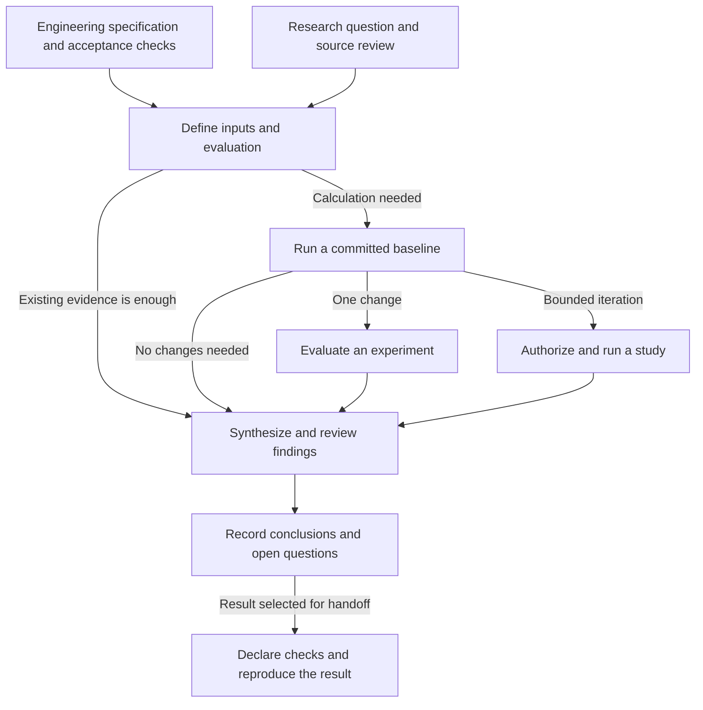
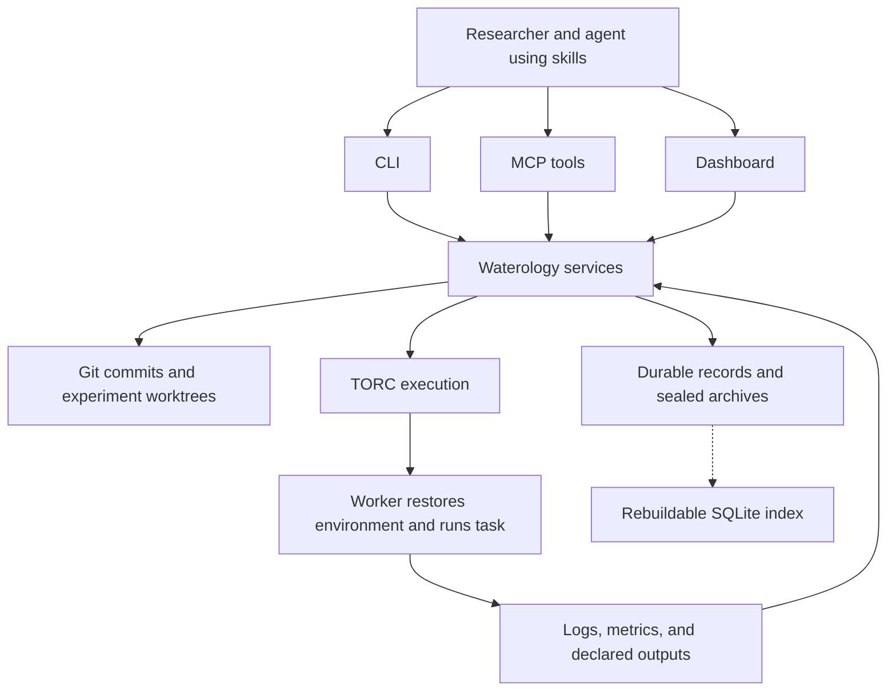
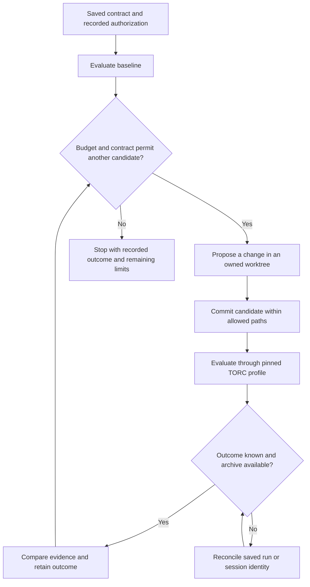
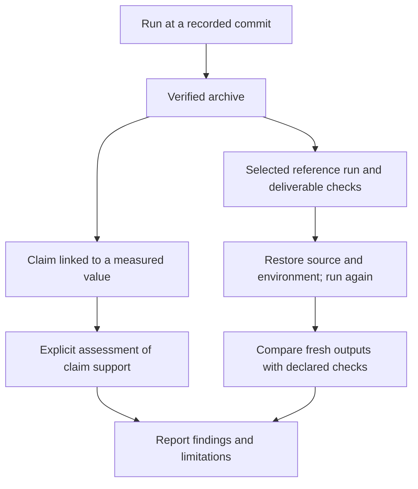

# How to use research and engineering workflows

Start with a specification or a research question and choose the smallest workflow
that produces the required evidence. Engineering begins with required behavior,
acceptance checks, and constraints. Research begins with an estimand or question
and the evidence needed to address it. A literature review can use skills alone. A calculation can
use a registered workflow. A sequence of candidate changes can use a managed
study. A selected result can become a deliverable with explicit reproduction
checks.

This guide explains those choices. Follow [Getting started](getting-started.md)
for installation and [Execute and reproduce a project](workflow-execution.md)
for complete configuration examples. The figures use Mermaid, with a text
explanation below each diagram for readers without diagram support.

## Choose a starting point

| What you need | Start with | What you keep |
| --- | --- | --- |
| Build, fix, or optimize software against requirements | `engineering-workflow` and `waterology engineering` | Specification, candidate commits, and acceptance evidence |
| Understand prior work or refine a question | `literature-review`, `deep-research`, or `source-comparison` | Sources, selection rationale, and a cited synthesis |
| Design a defensible analysis | `simulation-study`, `replication`, or `pipeline-manifest` | Estimand, design, inputs, evaluation criteria, and run order |
| Run an existing project task | A named workflow | A run archive tied to a committed source version |
| Test one deliberate change | An experiment worktree and a run | The candidate commit, measurements, and assessment |
| Evaluate a bounded sequence of changes | A managed study | Frozen evaluation, candidate history, budgets, and outcomes |
| Explain or challenge results | `paper-writing`, `research-review`, or `audit-reproducibility` | A report, critique, or claim-to-output audit |
| Hand off a selected result | A deliverable and reproduction check | Reference run, declared checks, export, and reproduction outcome |

Skills guide an agent's work. They do not all launch a managed calculation.
Ask for them by their canonical names, for example: "Use literature-review to
compare these methods and save the source selection rationale." See the
[research skill catalog](../README.md#research-workflows) for command aliases.



_Figure 1. Engineering can finish with acceptance or unmet requirements. A research task can finish with a synthesis, a negative finding, or
an unresolved question. Experiments and managed studies are branches of the
workflow, not required steps for every task._

## What each piece owns

A __workflow__ is a named execution recipe, such as `evaluate` or `render-report`.
An __experiment__ identifies a hypothesis or candidate source variant. A __run__
is an execution attempt at a particular commit. A __study__ coordinates bounded
candidate evaluations. A __deliverable__ names a selected reference run and the
checks a fresh reproduction must pass.

| Piece | Responsibility | Use it when |
| --- | --- | --- |
| Skills | Research method, task structure, and review guidance | An agent needs a procedure for the work |
| Agents and sessions | An assigned role, owned worktree, task brief, and session logs | You delegate a scoped task or supervise candidate generation |
| Git | Source versions and isolated candidate changes | You need to identify exactly what was evaluated |
| Pixi, uv, or rv | The declared software environment | A run needs its dependencies restored |
| Waterology | Experiment, run, study, evidence, and deliverable records | You need traceable execution and assessment |
| TORC | Jobs, workers, dependencies, scheduling, and retries | You execute named workflows or managed studies |
| CLI, MCP, and dashboard | Interfaces to shared services | You operate or inspect project state |

The interfaces share records, but do not expose identical operations. The CLI
supports the full lifecycle. MCP provides bounded agent tools. The dashboard
makes project state and supported actions visible. Installing research skills
for a runtime does not establish that supervised sessions work in that runtime.
See [Agent sessions and MCP](../README.md#agent-sessions-and-mcp).



_Figure 2. Named workflows and studies use TORC for execution. Waterology records
what ran and preserves its evidence. Environment restoration happens on the
worker. SQLite indexes durable state and can be rebuilt from it._

The older single-command experiment API also supports `direct` execution.
Named workflows and managed studies require a TORC profile, including on a local
machine. Use the [TORC guide](torc.md) to prepare workers. A remote profile alone
does not copy a project or make its data available on another host.

For implementation, repair, and optimization examples, start with the
[engineering guide](engineering.md). It uses these same execution and evidence
services without requiring a scientific hypothesis.

## From a project task to recorded evidence

Suppose a reservoir model already has a Pixi task named `evaluate`. It reads fixed
inputs and writes `results/metrics.json`. Start by making the evaluation contract
explicit: input identities, outputs, metric extraction, environment files,
restoration command, and worker environment probe. The
[workflow definition example](workflow-execution.md#register-and-run-an-evaluation)
shows those fields.

After installing the CLI, work from the research repository:

```console
waterology init
waterology config refresh --check
waterology workflow register evaluate --task evaluate
waterology workflow list
waterology config show
```

Discovery identifies execution recipes. It cannot choose the scientific metric
or acceptance criterion. Inspect and complete the definition before committing
it. Ignore generated results in Git and include them in declared artifact roots.
The check command can return nonzero when configuration updates or drift need
attention; it does not execute the model.

Commit the intended source and configuration with the project's Git conventions.
Then run from a clean checkout with a configured local TORC profile:

```console
waterology workflow run evaluate --profile local
waterology archive verify RUN_ID
```

Replace `RUN_ID` with the returned identifier. `workflow run` creates an
experiment at the selected commit, waits for execution, collects evidence, and
seals the run. A baseline needs no artificial source change. For a detached run,
use `--detach` and collect it later with `waterology workflow watch RUN_ID`.

Inspect outputs, units, diagnostics, and input coverage before interpreting a
metric. Archive verification checks integrity. It does not establish that the
model or scientific conclusion is correct.

### Decide whether to iterate

For one candidate, create an experiment using the same workflow, open its
worktree, make the intended change, and commit it there:

```console
waterology experiment create "Test an alternative release rule" --workflow evaluate
waterology worktree open EXPERIMENT_ID
```

Run that committed candidate with the selected profile and inspect its archive:

```console
waterology run start EXPERIMENT_ID --profile local
waterology run watch RUN_ID
waterology archive verify RUN_ID
```

For repeated candidate generation, first establish a stable baseline and save a
[managed study contract](managed-studies.md#prepare-a-contract). Set
`workflow: evaluate`; omitting `baseline_experiment` lets study creation make the
baseline experiment. Use __research mode__ to address a scientific question, or
__engineering mode__ to meet declared thresholds. In either mode, define the
allowed edit paths, protected evaluation, inputs, uncertainty treatment, budgets,
and stop behavior before authorizing execution.



_Figure 3. A study preserves the evaluation while candidates change. An unknown
execution outcome must be reconciled before further submission. Stopping does
not itself establish success. The saved drain or cancel policy governs active
work when the study stops._

`study watch` evaluates queued candidates. It does not invent them. Use manual
candidate proposals or explicitly configure a bounded runtime driver, then use
`study run` to drive it. The [start and resume instructions](managed-studies.md#start-and-resume)
cover both paths. A driver does not grant additional runtime permissions.

The study enforces attempt limits and a wall-clock deadline. It does not meter
CPU-hours or model token costs. Choose an execution setup whose actual controls
match the authorized budget.

## From measurements to a result you can hand off

Keep four judgments separate: execution finished, the archive is intact, the
claim is supported, and the selected result reproduces. Each answers a different
question.



_Figure 4. Claim review and reproduction are separate uses of archived evidence.
A matching value does not prove a scientific interpretation. Reproduction checks
only establish the criteria declared for the selected deliverable._

Use `compare-runs` to inspect compatible archived results. Keep failed,
incompatible, and missing results visible. Use `claim` to link a statement to an
archived value and `claim-assess` to record whether that evidence supports the
statement. An `answer` run assessment can retain a supported negative finding;
it need not mean an intervention improved the model. See
[Compare, assess and report](managed-studies.md#compare-assess-and-report).

Select a reference run explicitly, then declare byte, numeric, or statistical
checks in a deliverable definition. Numeric tolerances need a scientific or
numerical justification. Statistical checks need an implemented validator.
[Reproduction](workflow-execution.md#select-and-reproduce-the-final-result)
restores source and environment, executes again, and compares fresh outputs with
the reference. Exports preserve the selected source and evidence, but do not
harvest ignored inputs. Document access and identity requirements for external
data before handing off the result.

| Observation | What to do next |
| --- | --- |
| A command finished successfully | Inspect metrics, outputs, and diagnostics |
| Archive verification passed | Assess whether the evidence supports the claim |
| A candidate improved one metric | Check every constraint and declared uncertainty |
| Execution status is unknown | Reconcile the saved identity before resubmitting |
| The study budget is exhausted | Record findings and unresolved questions without starting new work |
| Reproduction is blocked | Resolve the recorded prerequisite; do not describe it as an output mismatch |
| Reproduction passed | Report the checks and environment covered by that result |

Use `paper-writing` for a report, `research-review` for a critique, and
`audit-reproducibility` to trace manuscript numbers to produced outputs. Save a
session log for unfinished work. Retrieve verified project lessons before the
next substantial task. Neither a report nor a completed study automatically
publishes, deploys, or changes shared skills.

## Export provenance with RO-Crate

Sealing a run also creates a derived crate under `.waterology/ro-crates/RUN_ID/`.
It contains a copy of the sealed archive and JSON-LD describing execution and
artifacts. Create a separate copy with:

```console
waterology archive export-crate RUN_ID exports/run-crate
```

Use the crate to exchange run provenance. Use a deliverable export and
`waterology reproduce` for a selected result with declared reproduction checks.
Crate metadata validation, payload integrity, and reproduction are separate
checks. The [RO-Crate guide](ro-crate.md) explains contents, automatic export,
profile declarations, validator behavior, and current interoperability limits.

## Where to look next

- [Engineering](engineering.md): specifications, cumulative implementation, and constrained optimization.

- [Configuration](configuration.md): project execution and evidence settings.
- [Personal configuration](local-configuration.md): private preferences and machine settings.
- [Workflow execution](workflow-execution.md): registration, execution, deliverables, and reproduction.
- [Managed studies](managed-studies.md): contracts, candidate drivers, recovery, claims, and reports.
- [TORC execution](torc.md): workers, profiles, scheduling, and connection failures.
- [RO-Crate integration](ro-crate.md): run provenance export and validation.
